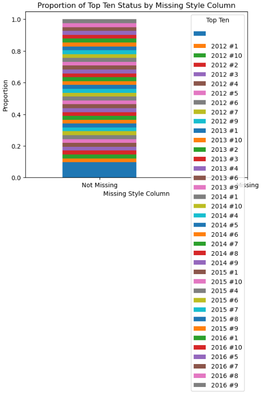
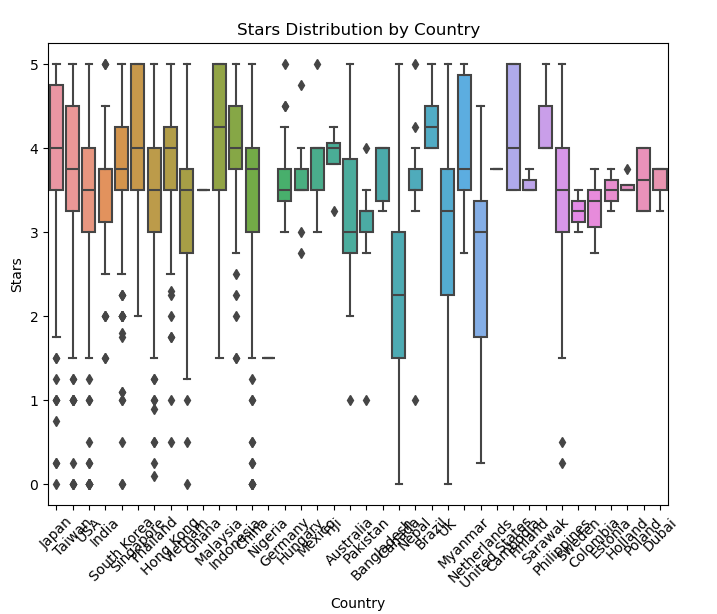
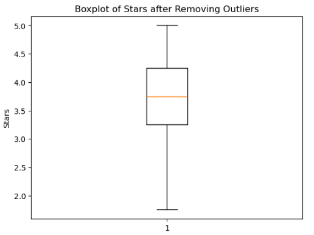
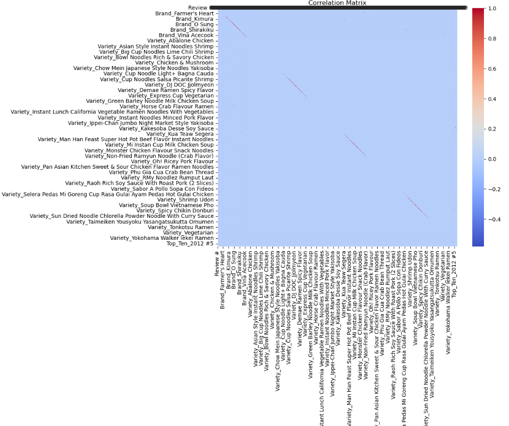

# Celebal_Assignment4
# Data Preprocessing and feature engineering
# Ramen Ratings Analysis

This repository contains the code and analysis for the Ramen Ratings dataset. The project involves preprocessing, exploratory data analysis (EDA), feature engineering, and visualization of the ramen ratings data.

## Table of Contents

- [Introduction](#introduction)
- [Dataset](#dataset)
- [Installation](#installation)
- [Usage](#usage)
- [Features](#features)
- [Results](#results)
- [License](#license)

## Introduction

The goal of this project is to analyze the Ramen Ratings dataset, perform data preprocessing, visualize the data, and extract meaningful insights. We use various data processing techniques, including handling missing values, encoding categorical variables, and feature engineering.

## Dataset

The dataset used in this project is `ramen-ratings.csv`, which contains information about different ramen brands, their ratings, and other relevant attributes.

### Columns in the dataset:
- `Review #`: Review identifier
- `Brand`: Brand of the ramen
- `Variety`: Variety of the ramen
- `Style`: Style of the ramen (e.g., Pack, Cup)
- `Country`: Country of origin
- `Stars`: Rating out of 5
- `Top Ten`: Ranking in the Top Ten

## Installation

1. Clone the repository:
   ```bash
   git clone https://github.com/your-username/Celebal_Assignment4.git
   cd Assignment4
   ```

2. Create and activate a virtual environment:
   ```bash
   python -m venv env
   source env/bin/activate   # On Windows use `env\Scripts\activate`
   ```

3. Install the required packages:
   ```bash
   pip install -r requirements.txt
   ```

## Usage

1. Place the `ramen-ratings.csv` file in the repository directory.
2. Run the Jupyter notebook or Python scripts to preprocess the data and perform analysis.
3. View the generated plots and insights.

### Sample Commands

To run the analysis scripts, use:
```bash
python Assignment4.ipynb
```

## Features

- Data Preprocessing:
  - Handling missing values
  - Converting categorical variables to numerical using one-hot encoding
  - Scaling numerical features
- Exploratory Data Analysis (EDA):
  - Frequency distribution of categorical variables
  - Descriptive statistics of numerical variables
  - Visualization using bar plots, histograms, and box plots
- Feature Engineering:
  - Creating new features such as `FamilySize`, `Is_TopTen`, `Length_of_Brand`, and `Length_of_Variety`
- Outlier Detection and Removal:
  - Detecting outliers in the `Stars` column using the boxplot method
- Correlation Analysis:
  - Visualizing the correlation matrix using a heatmap

## Results

### Example Visualizations

#### Proportion of Top Ten Status by Missing Style Column


#### Stars Distribution by Country


#### Boxplot of Stars


#### Correlation Matrix


## License

This project is licensed under the MIT License - see the [LICENSE](LICENSE) file for details.
```

